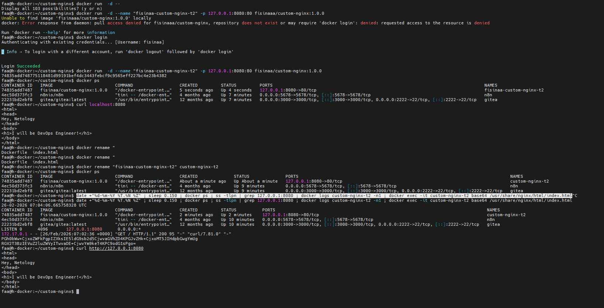

Задача 1
https://hub.docker.com/repository/docker/fisinaa/custom-nginx/general
docker run -d -p 8080:80 fisinaa/custom-nginx:1.0.0
задача_2 

задача 3
см картинки 
объяснение проблемы внутри контейнера поменяли порт на 81, а в конфиге мы смапили порт 80 вот оно и не идет. показывает старый порт 80 
задача 5
после удаления compose.yaml, остался запущенный контейнер но его файл .yaml мы удаллили нет его, нет конфигурации описания итп docker compose up -d --remove-orphans - вычистит его docker compose down удалит весьпроект
